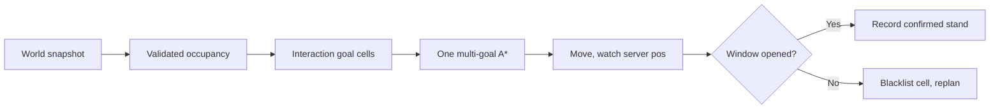

# Pathfinder reliability

The product goal is **not** “A* to a cupboard origin.” It is a reusable navigator that can walk tight aisles anywhere in the world, plus a cupboard catalog that uses that navigator.

**100% never-fail is the target, not a claim about the current grid.** The server’s collision and click-range rules are not fully visible. The client must combine geometry with server feedback (did the character actually move, did a window appear) and treat disagreement as a map bug, not a route bug.

Catalog automation uses one occupancy snapshot, face-hug N/E/S stands (never west; inflated allowed), occupancy-adjacent approach cells (Nurgling `findFreeNearByHB`), one multi-goal A* with a carved stand pocket, and a cupboard window as success.

Nurgling ([Katodiy/nurgling2](https://github.com/Katodiy/nurgling2)) stamps each gob's **oriented OBB** onto half-tile cells via cell-square intersection, skips the player, and treats destination stands as **free cells cardinally adjacent to the target hitbox**. The last click snaps onto the gob's axis, 2 units outside the box (`isHardMode`). A failed `GoTo` rebuilds from the live player position. Thunder keeps furniture unpadded (Haven lets you overlap Neg) and never walks west; the catalog now uses that same face-hug + adjacent-cell approach instead of a 1-tile offset that lands on the next packed origin.

## Occupancy rule (Phase 2)

Neg layers are **placement** (the pink box). Obstacle layers are **movement-solid**. Packed furniture is not a Minkowski wall:

- Raster Obstacle (skip `id=build`). Include Neg **only** when a resource has no Obstacle at all.
- Cupboards and other `furnitureFootprint` objects use Obstacle only. A Neg-only 10×10 is not occupancy-solid — Haven lets the player overlap those boxes.
- Furniture rasters with half-cell `OVERLAP` aliasing only. There is no body-radius pre-pad and no cupboard AABB fill.
- Walls, houses, and terrain are Minkowski-expanded by the **oriented** player hitbox (it rotates with facing — not a world-locked diamond). Packed furniture is not inflated; the body may overlap those Neg boxes.
- A 1-cell Chebyshev cap is **not** used as the body model. That planned routes for a point (2.75u inflate vs a ~4.2 diamond) and clipped walls. The cap existed to keep packed cupboard aisles open; those aisles stay open because furniture is not inflated.

Packed cupboards are 10×10 world boxes with origins 11 apart (1-unit gap). Treating that Neg box as a wall and expanding it by leftover player radius (~2.5) plus one dilated cell (2.75) sealed the aisle. Idle stands 0.32 tiles from a cupboard polygon are legal; occupancy must not mark them solid.

`observe()` and `plan()` share `rasterGobs`. Probe HUD `movement` vs `hitbox` differ when both Neg and Obstacle exist.

## Architecture



Navigation Lab (Phase 1): `PfTestRunner` is the localhost facade over `PfScenarioRegistry` + `PfTestHarness` + per-scenario classes. `PathfinderDebug` overlays occupancy (raw / body-inflated), dynamic hazards, start/goal regions, raw A* vs smoothed route, the active waypoint, replanning reason, and server-confirmed position. Completed allowlisted runs emit a **NavReplay v1** JSONL artifact; `NavReplayRunner` replays `planCore` from that occupancy without a live game connection. Planner fundamentals are unchanged: quarter-tile `2.75` cells, oriented obstacles, body clearance, eight-way A*, no-corner-cutting, collision-checked smoothing.

Phase 1 live-gate (fresh Navigation Lab jar): the client reached the login screen on `127.0.0.1:18762` using `bin/navigation-lab.jar`. `GET /login?user=Rip Van Winkle` returned `no matching saved account`. Occupancy-rich live `observe` / `.navreplay.jsonl` therefore still requires a manual login. Unit and offline NavReplay evidence from the Phase 1 commit remain the recorded gate.

HavenNavigationCore (Phase 2): occupancy raster helpers, body clearance, eight-way A*, no-corner-cutting, collision-checked smoothing, receding-horizon control, goal-region selection, and NavReplay v1 parse live in the standalone Java 8 module `HavenNavigationCore/`. Thunder compiles against and ships `bin/HavenNavigationCore.jar` (`Class-Path` on `navigation-lab.jar`). `GET /status` reports `navigation_core_git` / `navigation_core_title` from the core JAR manifest. `PrototypePathfinder` keeps GameUI/Gob rasterization and command execution; planning calls `LocalPlanner`.

Phase 5 world graph: `GraphNode` / `GraphEdge` / `WorldGraph` / `WorldRouter` / `TransitionMachine` sit above local A* and `SurfaceController`. Nodes are opaque world/segment/layer/area strings — layer numbers never imply adjacency. Transition edges exist only after both endpoints are observed. Water is blocked unless `MobilityProfile` swim or boat is active. Thunder `WorldGraphAdapter` / `TransitionAdapter` capture GameUI topology and vehicle state; allowlisted `transition_*` / `boat_*` / `vehicle_*` / `hearth_travel` / `explore_frontier` scenarios fail closed with `NO_FIXTURE` / `NO_GAME`. NavReplay v1 may include an optional `graph` object.

Phase 6 release matrix: `tools/pf_matrix.py` drives allowlisted `POST /pf/run` / `GET /pf/result` only. `NO_FIXTURE` / `NO_GAME` count as NOT_RUN, not PASS. Live consecutive-run counts require an in-game Navigation Lab session. The former 30-minute mixed-route soak is replaced by a user-defined critical-route campaign (`tools/critical-routes.json`): each enabled route must complete both applicable directions for 5 consecutive runs, hold the original POINT destination across transitions, use server-confirmed arrivals, emit a NavReplay artifact, and fail on unrecovered stalls or false success. `GET /status` reports `navigation_core_version` alongside the core git hash. Local `planCore` p95 is gated by `LocalPlannerLatencyTest` (excludes network/ticks). Surface categories that share `LOCAL_OBSTACLE_OR_CORRIDOR` are not distinct forest/corridor/building fixtures. Missing water/cliff/moving/hostile/boat/vehicle/transition live fixtures stay NOT_RUN. navigation-core `0.1.0` is not cut until the full live gate passes.

Phase 4 interaction goals: `NavGoal.INTERACTION` carries an `InteractionSpec` (target identity, footprint AABB, allowed approach sides, min/max distance, clearance, optional facing, expected-result descriptor). `InteractionGoals` samples legal stand poses around the footprint without carving the target from occupancy, then streams to the selected pose through the existing `SurfaceController`. Arrival emits `NavDecision.INTERACT`; Thunder verifies forage disappearance/inventory, container windows, and door/gate `sdt` changes. Allowlisted `interact_*` scenarios fail closed with `NO_FIXTURE` / `NO_GAME`.

Phase 3 continuous surface execution: `SurfaceController` / `SurfaceStream` in the shared core stream movement to the farthest legal smoothed waypoint, hand off while moving when the next corridor is still valid, and require idle-within-tolerance only at the original `NavGoal`. Local/receding-horizon completion is not success. Early stops, corridor invalidation, relevant obstacle changes, mobility changes, and deviation trigger bounded recovery (rebuild snapshot → failed-segment blacklist → high-clearance escape cell → original-goal replan → `STUCK`). Thunder `WaypointWalker` only executes those decisions. NavReplay v1 keeps optional fields for selected/considered waypoints, corridor checks, recovery count, blacklist, and escape.

Phases:

1. **Mechanics probe** — record polygons, occupancy, clicks, vanilla steps.
2. **Validate occupancy** (this change) — Neg is placement, Obstacle is movement; packed furniture is not a Minkowski wall; idle player is never movement-solid.
3. **Multi-goal A*** — one occupancy build, many goal cells, one search.
4. **Server-aware execution** — window is success; distance is not.
5. **Catalog dependency graph** — exact via cupboard; no west-through-furniture reach.
6. **Fixtures** — 1 cupboard → aisle → lateral chain → full room × 4 starts.

## How we debug (including launch)

I cannot play the game window for you. After a rebuild, a localhost control port lets me drive the **already running** client (one session per account):

```bash
python tools/pf_drive.py status
python tools/pf_drive.py wait --login          # if you launched with HAVEN_AUTOLOGIN=true
python tools/pf_drive.py probe                 # :pf probe
python tools/pf_drive.py probe step rel 0 -11
python tools/pf_drive.py cmd pf debug
python tools/pf_probe.py bin/dev-snapshots/pf/probe.jsonl
```

The niri launch script binds `127.0.0.1:18761`. Relaunch once so `[dev-control]` appears on stderr. Do not start a second client while you are already logged in.

```bash
# Rebuild + launch (you still need to be in the cupboard room)
ant niri-bin
./launch-thunder-nvidia.sh
# optional: HAVEN_AUTOLOGIN=true HAVEN_AUTOPLAY='YourChar' ./launch-thunder-nvidia.sh
```

Manual console still works: `:pf probe`, `:pf probe click`, `:pf probe step rel 0 -11`, `:pf probe last`.

Log file: `bin/dev-snapshots/pf/probe.jsonl`

### What a good first session captures

Stand still in an aisle (character legally placed by the server).

1. `:pf probe` — if HUD says `LEGAL POS MARKED SOLID`, occupancy is wrong. That is the whole Phase 2 bug. Do not catalog.
2. `:pf probe click` on a cupboard you can already open by hand. Records player pos, polygon distance (not gob.rc), click coord, whether a window appeared, extender ids.
3. Repeat with one cupboard already open (extended reach) on a neighbour you cannot open alone.
4. `:pf probe step rel 11 0` — vanilla walk. Compare `start_in_solid` / `stop_in_solid` to where the server left you.

Overlay ( `:pf debug` turns on with probe): magenta = solid, orange = inflated, green diamond = body. Probe HUD lists nearest cupboard **polygon** distances.

## Commands we stopped using for classification

`findStand()` uses one occupancy snapshot. Stands are face-hug cells 2 units outside the 11×11 box (Nurgling hardMode), plus occupancy-adjacent N/E/S cells, plus a 1-tile fallback. A stand must not be SOLID, must not sit inside another cupboard's 10×10, and (if inflated) must cardinally touch open ground. `planAny(..., snap=false)` then carves a body pocket on those dilated goals so A* can arrive. Unwalkable cupboards are opened through a N/E neighbour; a walkable cupboard whose A* still reports `partial` falls back to that neighbour instead of walking into furniture. A short stop rebuilds from the live player position (up to 8 replans).

## Failure categories (catalog / execution)

Keep these separate in logs once execution is rebuilt:

| Category | Meaning |
|---|---|
| Movement warning recovered | Stopped early, window still opened |
| Interaction success | Server created the cupboard window |
| Route unavailable | No remaining goal cells |
| Interaction rejected | Clicked, no window |
| Dependency unavailable | Planned via cupboard failed |
| Timeout | Waited, still moving or no window |

Distance-only “arrived” is not success.

## Tests

Offline (no game): `ant test` — grid dilation, packed 11-apart aisle, 0.32-tile stand-is-free, `movementPolygons` vs Neg, occupancy encoding.

Online: probe JSONL + `tools/pf_probe.py`. The invariant **idle player must not be `player_in_solid`** is printed as `INVARIANT FAIL`.

Allowlisted live scenarios and the control-port API are listed in [pf-test-runner.md](pf-test-runner.md).
